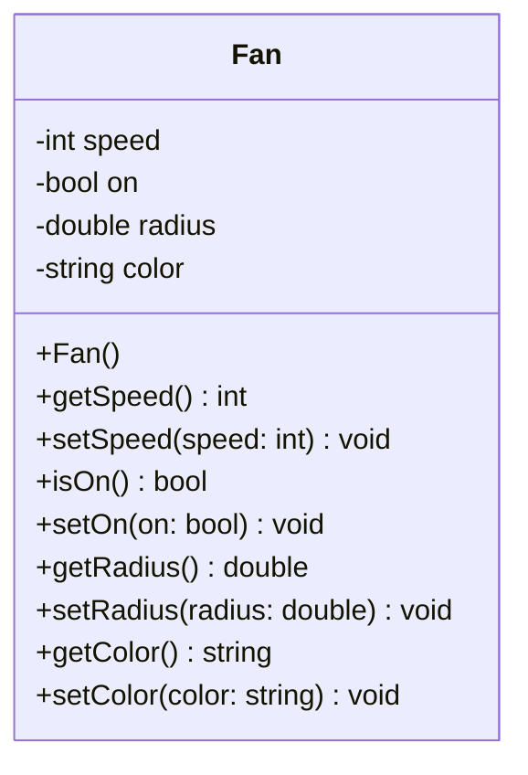
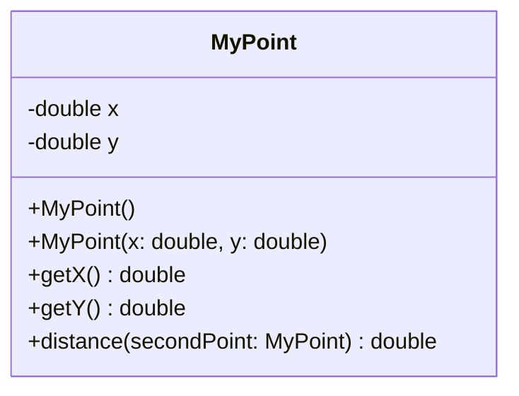
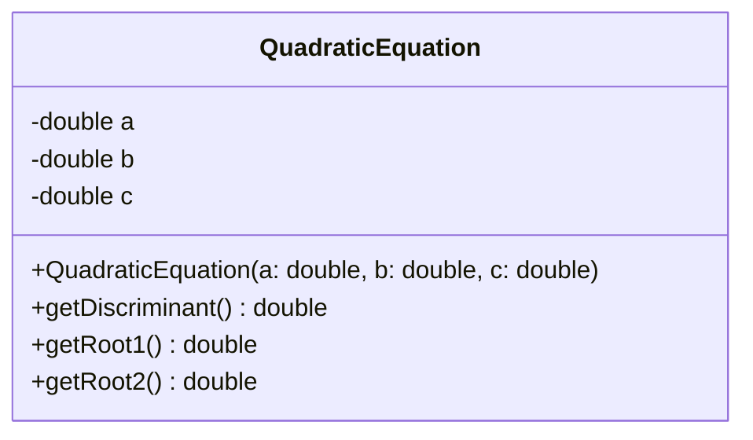
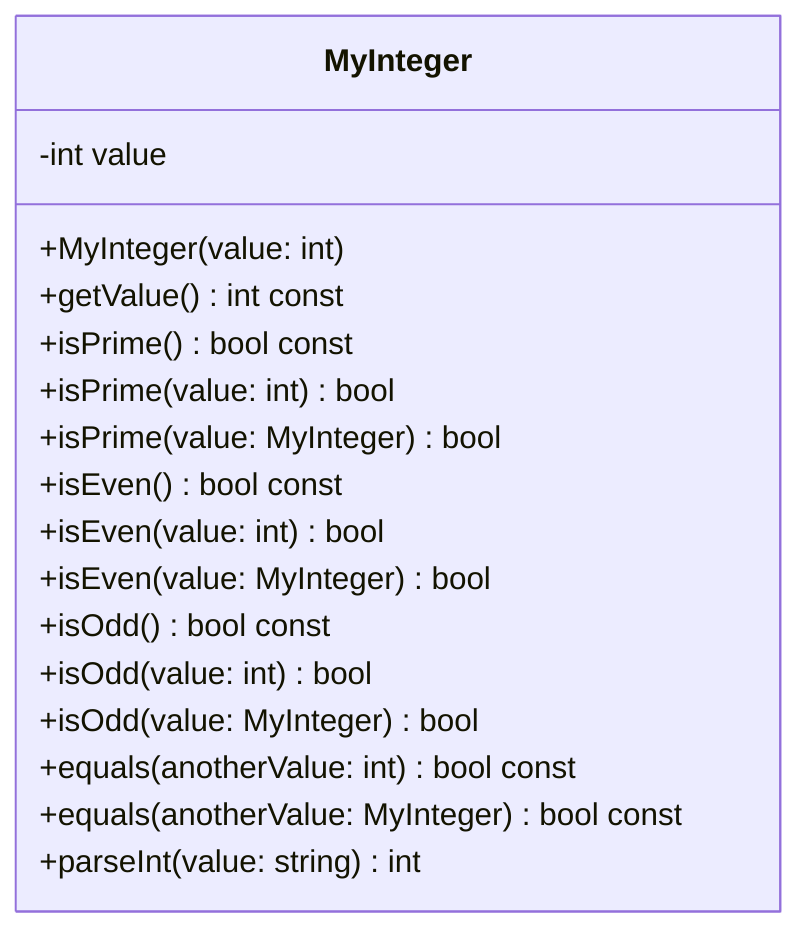
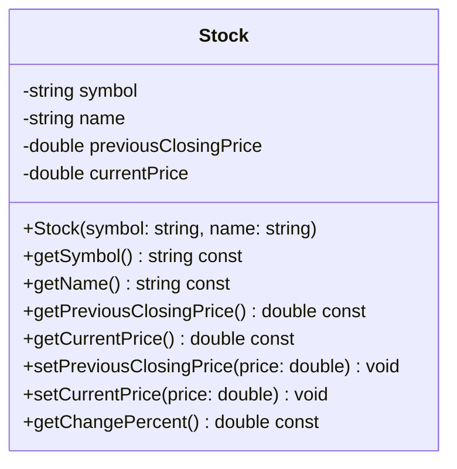
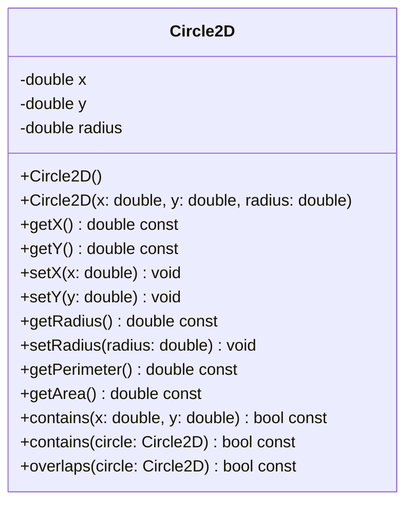
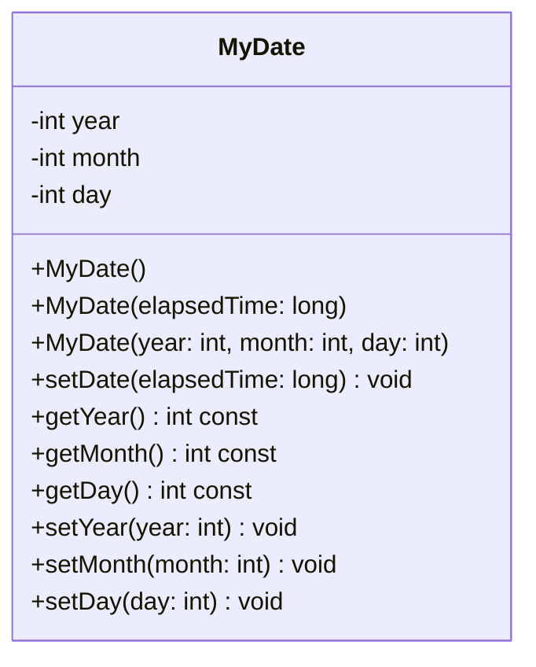
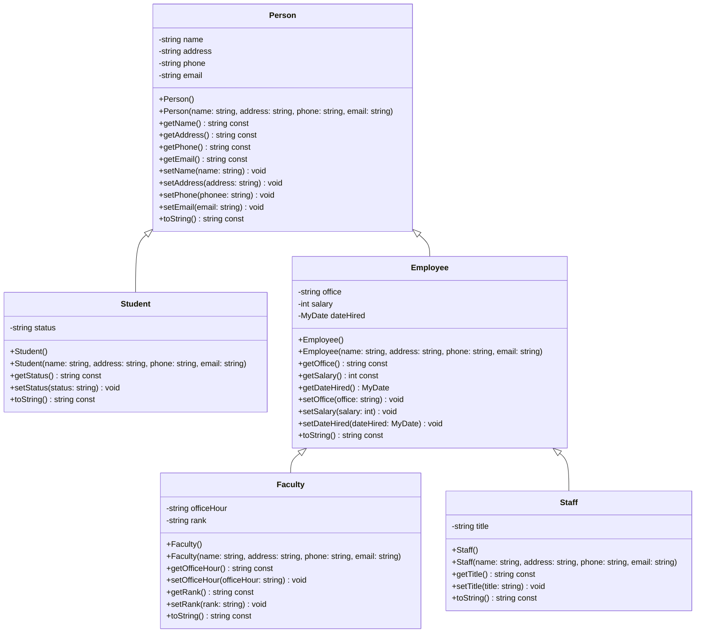
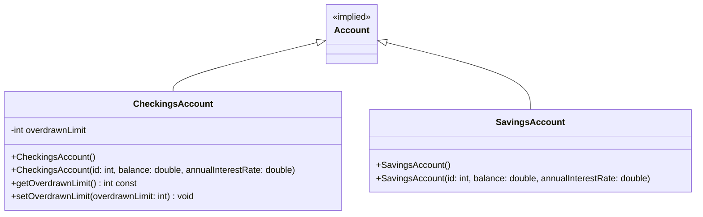

# Solutions for UML Class Diagrams (Even-Numbered Exercises)

本文档将 `EvenNumberedExerciseUMLDiagram.pdf` 中的类图转换为了 Markdown 格式，并使用 **Mermaid** 语法绘制了原生的 UML 类图。您可以在支持 Mermaid 的编辑器（如 VS Code, GitHub, Typora 等）中直接查看可视化的类图。

---

## Chapter 9

### Exercise 9.2: Fan (风扇类)

#### 属性说明 (Attributes)
* `-speed: int`：风扇的速度（默认为 1）。
* `-on: bool`：指示风扇是否开启（默认为 `false`）。
* `-radius: double`：风扇的半径（默认为 5）。
* `-color: string`：风扇的颜色（默认为 "blue"）。

#### 方法说明 (Methods)
* `+Fan()`：默认构造函数，构造一个速度为 1、关闭状态、半径为 5 的风扇。
* `+getSpeed(): int` / `+setSpeed(speed: int): void`：速度的 Getter / Setter。
* `+isOn(): bool` / `+setOn(on: bool): void`：开关状态 of Getter / Setter。
* `+getRadius(): double` / `+setRadius(radius: double): void`：半径的 Getter / Setter。
* `+getColor(): string` / `+setColor(color: string): void`：颜色的 Getter / Setter。

---

### Exercise 9.4: MyPoint (点类)

#### 属性说明 (Attributes)
* `-x: double`：点的 X 坐标。
* `-y: double`：点的 Y 坐标。

#### 方法说明 (Methods)
* `+MyPoint()`：默认构造函数，创建一个位于 (0, 0) 的点。
* `+MyPoint(x: double, y: double)`：带参构造函数，指定 X 和 Y 坐标。
* `+getX(): double` / `+getY(): double`：获取坐标的 Getter 方法。
* `+distance(secondPoint: MyPoint): double`：计算当前点到另一个点的距离。

---

### Exercise 9.6: QuadraticEquation (一元二次方程类)

#### 属性说明 (Attributes)
* `-a: double`，`-b: double`，`-c: double`：一元二次方程的三个系数。

#### 方法说明 (Methods)
* `+QuadraticEquation(a: double, b: double, c: double)`：带参构造函数，初始化三个系数。
* `+getDiscriminant(): double`：求判别式（$b^2 - 4ac$）。
* `+getRoot1(): double`：返回方程的第一个根（当判别式非负时）。
* `+getRoot2(): double`：返回方程的第二个根（当判别式非负时）。

---

## Chapter 10

### Exercise 10.10: MyInteger (整型包装类)

#### 属性说明 (Attributes)
* `-value: int`：包装的整数值。

#### 方法说明 (Methods)
* `+getValue(): int const`：获取整数值。
* **素数判断 (Prime)**：
  * `+isPrime(): bool const`：判断当前对象的值是否为素数。
  * `+isPrime(value: int): bool` (静态)：判断指定的 `int` 是否为素数。
  * `+isPrime(value: MyInteger): bool` (静态)：判断指定 `MyInteger` 对象中的值是否为素数。
* **偶数判断 (Even)**：
  * `+isEven(): bool const`：判断当前值是否为偶数。
  * `+isEven(value: int): bool` (静态) / `+isEven(value: MyInteger): bool` (静态)。
* **奇数判断 (Odd)**：
  * `+isOdd(): bool const`：判断当前值是否为奇数。
  * `+isOdd(value: int): bool` (静态) / `+isOdd(value: MyInteger): bool` (静态)。
* **相等判断 (Equals)**：
  * `+equals(anotherValue: int): bool const`
  * `+equals(anotherValue: MyInteger): bool const`
* **静态转换**：
  * `+parseInt(value: string): int`：将字符串转换为 `int`。

---

### Exercise 10.12: Stock (股票类)

#### 属性说明 (Attributes)
* `-symbol: string`：股票代码。
* `-name: string`：股票名称。
* `-previousClosingPrice: double`：前一日的收盘价。
* `-currentPrice: double`：当前的股票价格。

#### 方法说明 (Methods)
* `+Stock(symbol: string, name: string)`：带参构造函数。
* 各属性的 Getter/Setter 方法。
* `+getChangePercent(): double const`：返回股票价格变化的百分比。

---

## Chapter 11

### Exercise 11.8: Circle2D (二维圆类)

#### 方法说明 (Methods)
* `+getPerimeter(): double const`：求圆周长。
* `+getArea(): double const`：求圆面积。
* `+contains(x: double, y: double): bool const`：判断点是否在圆内。
* `+contains(circle: Circle2D): bool const`：判断另一个圆是否完全被包含在本圆内。
* `+overlaps(circle: Circle2D): bool const`：判断另一个圆是否与本圆相交/重叠。

---

### Exercise 11.12: MyDate (日期类)

#### 方法说明 (Methods)
* `+MyDate()`：无参构造函数，创建当前日期的对象。
* `+MyDate(elapsedTime: long)`：根据自 1970-01-01 以来的毫秒数创建日期对象。
* `+setDate(elapsedTime: long): void`：设置新的日期。

---

## Chapter 15

### Exercise 15.2: Person 继承体系 (人员与师生体系)

*注：原设计中 `Employee` 包含 `MyDate` 类型的成员属性 `dateHired`。*

---

### Exercise 15.4: Account 继承体系 (账户体系)

* `CheckingsAccount`（支票账户）具有一个透支限额属性 `-overdrawnLimit`。
* `SavingsAccount`（储蓄账户）直接继承 `Account`。
